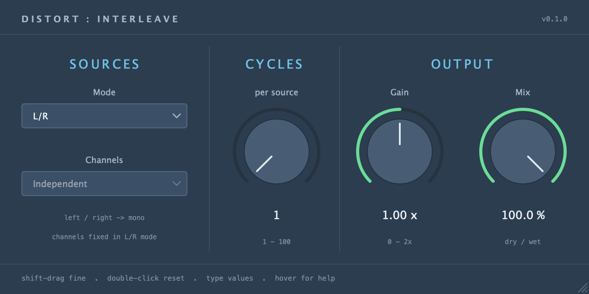

# DistInterleave

[](https://www.kvraudio.com/product/distinterleave-by-valentine-silvansky)

JUCE audio effect for VST3, Audio Unit (macOS), and standalone. Alternates groups of
pseudo-wave cycles from two live sources. DSP is independently implemented from
the algorithm description; no CDP source code is copied, translated, or linked.



[Demo video](https://youtu.be/RSmhS3QJX5I)

## Controls

| Control | Range / choices | Default |
| --- | --- | --- |
| Mode | L/R, In/Sidechain | L/R on stereo; forced In/Sidechain on mono |
| Channels | Independent, Left, Right | Independent; disabled in L/R |
| Cycles | 1-100 full cycles per source | 1 |
| Gain | 0-2x, linear post-mix output gain | 1x |
| Mix | 0-100% wet, linear blend | 100% |

L/R treats input left and right as separate sources. Output is mono, duplicated
when the output bus is stereo. Its dry signal is `(L + R) / 2`, so it stays mono
at every mix setting. In/Sidechain treats the main input and auxiliary input as
the two sources. Main input, sidechain, and output can each be mono or stereo,
independently. A mono source is duplicated for stereo processing; mono output
averages the processed channels.

Independent detection runs a separate interleaver for each output channel.
Left/Right uses that channel of each source to find boundaries, moving both
channels of that source together. On a mono source both choices use its single
channel. The host Mode parameter retains its saved stereo preference when an
instance is mono, but the DSP and editor always force In/Sidechain in that layout.

Gain applies after the dry/wet blend. There is no saturation, limiter, soft clip,
or hard clip in the DSP; output can exceed +/-1. Gain and Mix changes ramp over
10 ms. Controls support typed values, double-click reset, shift-drag fine adjustment,
and contextual help in the footer when hovered, without popup tooltips. Hover the
footer's `?` for sample rate, block size, block duration, version, and build date
(plus the audio device in the standalone). All five parameters are automatable
and saved in plugin state.

## Live cycle handling

A cycle extends from one negative-to-positive crossing to the next, encompassing
two sign changes. Exact-zero samples retain the preceding sign, avoiding phantom
crossings on zero plateaus. Initial partial cycles are discarded. Each source
captures complete cycles. Playback concatenates the selected number of cycles
from A, then the same number from B, preserving each cycle's original samples and
speed. Cycles are acquired individually, so a 100-cycle group does not have to be
captured in full before playback can begin.

Offline interleaving of two files can produce approximately twice the source
duration. A live effect cannot retain every incoming cycle indefinitely while
producing one output sample per input sample. This implementation keeps the most
recent completed, unplayed cycle per source, replacing older waiting cycles.
The cycle currently playing is never overwritten. There is no pitch correction,
time compression, or crossfade at the joins.

Capture is bounded to two seconds per individual cycle. Silence, DC, or sub-Hz
signals can reach that limit; a two-second segment then serves as a fallback
cycle. Cycles still counts 1-100 playback cycles before switching sources, including
at low audio frequencies. Startup and an unavailable next cycle produce wet silence
until the requested source has a completed cycle.
An absent/disabled sidechain bus passes the main input through; an enabled but
silent sidechain is processed as silence. Mode, Channels, layout, and Cycles
changes reset capture. The changing, source-dependent delay is part of the effect;
reported fixed latency is zero and dry audio is undelayed.

The engine preallocates its storage in `prepareToPlay`. Capture and playback use
buffer-index swaps: no audio-thread allocation, file I/O, locking, or whole-group
copies. The two independent stereo lanes use at most about 9.2 MB at 48 kHz.

## Downloads and releases

Prebuilt binaries are on the [releases page](https://github.com/silvansky/DistInterleave/releases):

- macOS universal (Apple Silicon and Intel): AU, VST3, and standalone, in separate ZIPs.
- Windows x64: VST3 and standalone, in separate ZIPs.

macOS downloads are ad-hoc signed and are not Developer ID signed or notarized.

[GitHub Actions](https://github.com/silvansky/DistInterleave/actions/workflows/build.yml)
builds and tests both platforms on pushes to `main`, pull requests, and manual runs.
To publish a release, set the version in `CMakeLists.txt`, commit it, and push a
matching tag (for example, `v0.1.0`). The tag must match the project version.
Once both platforms pass, the workflow uploads all five ZIPs and publishes the
GitHub release. Regular builds retain the ZIPs as workflow artifacts.

## Build

Requires CMake 3.22+, C++20, and a supported JUCE platform toolchain (Xcode command
line tools on macOS). JUCE is pinned to commit
`501c07674e1ad693085a7e7c398f205c2677f5da` (8.0.12). CMake fetches it unless an
existing checkout is supplied:

```sh
git clone https://github.com/silvansky/DistInterleave.git
cd DistInterleave
cmake -S . -B build -DCMAKE_BUILD_TYPE=Release
cmake --build build --parallel 6
ctest --test-dir build --output-on-failure
```

To reuse a local JUCE checkout without a download:

```sh
cmake -S . -B build -DCMAKE_BUILD_TYPE=Release -DJUCE_SOURCE_DIR=/path/to/JUCE
```

macOS universal builds can add `'-DCMAKE_OSX_ARCHITECTURES=arm64;x86_64'` at configure
time. VST means **VST3** here; the legacy VST2 SDK is not required. AU is built only
on macOS. Products are left in the build tree, without automatic installation:

- `build/DistInterleave_artefacts/Release/VST3/DistInterleave.vst3`
- `build/DistInterleave_artefacts/Release/AU/DistInterleave.component`
- `build/DistInterleave_Standalone_artefacts/Release/DistInterleave.app`

In a DAW, load the effect, select In/Sidechain, and assign the host's external
sidechain source. The auxiliary bus is initially disabled until a host enables it.
Supported layouts include mono-to-mono, mono-to-stereo, stereo-to-mono, and
stereo-to-stereo, each with disabled, mono, or stereo sidechain.

macOS bundles receive an ad-hoc signature for local use. Developer ID signing and
notarization are separate release steps.

To install the AU locally and validate host discovery, quit your DAW and run:

```sh
./install-au.sh
```

Like VarispeedDelay's installer, this signs the Release component, copies it into
`~/Library/Audio/Plug-Ins/Components`, refreshes the current user's audio component
registrar, and runs Apple's `auval` with the identity from the bundle. Use
`./install-au.sh --system` to install into `/Library/Audio/Plug-Ins/Components`
instead (requires sudo). Reopen your DAW and rescan Audio Units if needed. Building
alone does not install the AU, and the direct-load smoke test below does not check
host discovery. Native builds contain only the build machine's architecture; use
the universal build option above for Intel or Rosetta hosts on Apple Silicon.

In JUCE AudioPluginHost, use **Options > Edit the List of Available Plug-ins...**,
then **Options... > Scan for new or updated AudioUnit plug-ins**. Scanning the
VST3 build does not add the AU version to that list.

The standalone has a routing selector and mono/stereo output selector above the
editor. Use **Audio settings** to choose the device and enable up to four input
channels. Routing maps the first enabled hardware channel(s) to main input and
the next channel(s) to sidechain; unavailable channels are silent. It defaults to
stereo L/R on inputs 1-2. It processes live hardware inputs; it has no file player.

For an offscreen UI preview:

```sh
cmake --build build --target DistInterleaveShot --parallel 6
./build/DistInterleaveShot /tmp/DistInterleave.png
# Preview mono routing or footer help at a control's design coordinates:
./build/DistInterleaveShot /tmp/DistInterleave-mono.png mono
./build/DistInterleaveShot /tmp/DistInterleave-help.png stereo 636 315
```

Tests cover full-cycle concatenation and group sizes, stereo frame preservation,
zero plateaus, bounded DC/silence behavior, all bus-layout combinations, mono mode
forcing, host-block independence, unclipped gain, dry mixing, and state round trips.
On macOS, CTest also loads the built AU directly and renders all eight enabled
sidechain layouts without installing it. This test needs access to macOS's audio
component services and must run outside restrictive process sandboxes. The standalone
supports `--smoke-test` to open and close its window without starting hardware audio.

## Project layout

- `src/InterleaveEngine.h`: framework-independent cycle capture and playback.
- `src/PluginProcessor.*`: bus layouts, parameters, routing, mixing, and saved state.
- `src/PluginEditor.*` and `src/LookAndFeel.*`: editor and Varispeed-derived styling.
- `src/Standalone.cpp`: desktop app with hardware input and output routing.
- `tests/`: engine and processor regression tests.
- `tools/`: editor screenshot generator and macOS AU load/render test.
- `docs/`: rendered editor previews.

See [AGENTS.md](AGENTS.md) for development conventions and verification commands.
Build products and fetched dependencies stay under the ignored `build/` directory.

## UI provenance and dependencies

The palette, typography, knobs, and control styling follow VarispeedDelay's
`STYLE.md`. `src/LookAndFeel.h` and `.cpp` are reused from that project under its
MIT option; the required notice is in `LICENSE.txt`.
JUCE and its bundled dependencies retain their own licenses; see the pinned
JUCE checkout's `LICENSE.md` for its AGPL/commercial licensing options.
